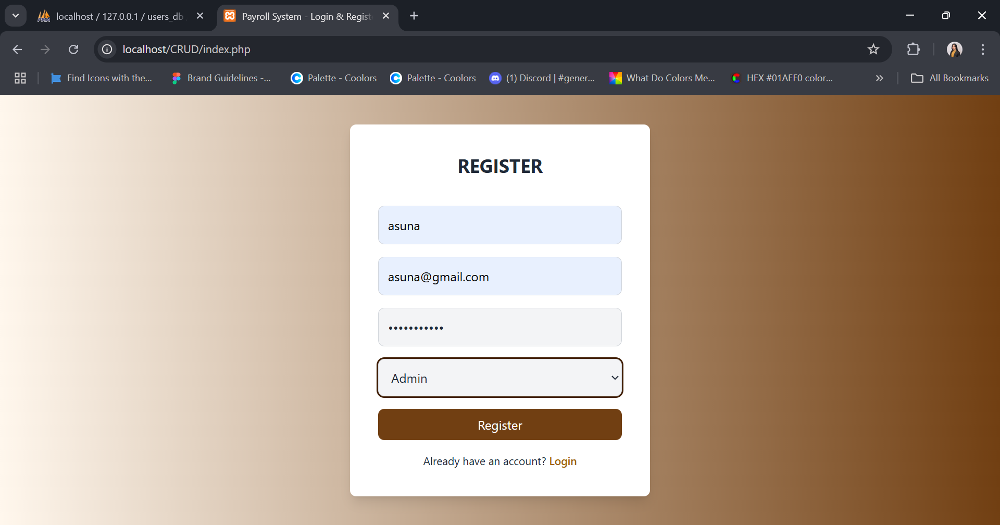
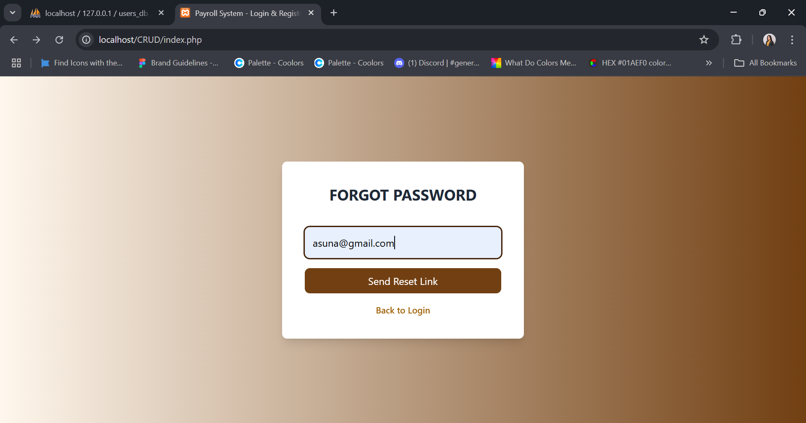
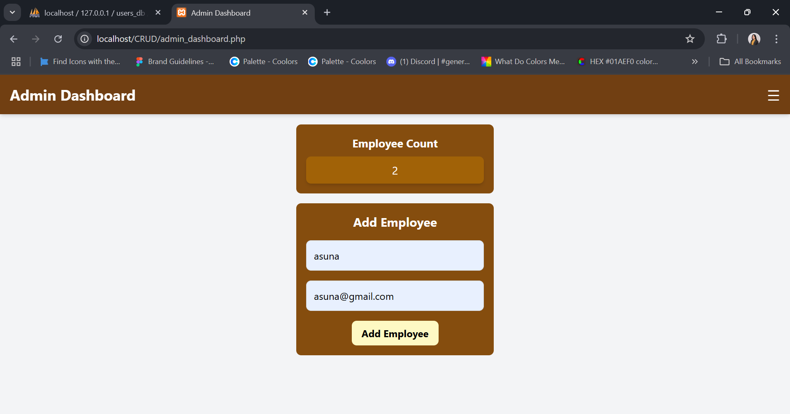
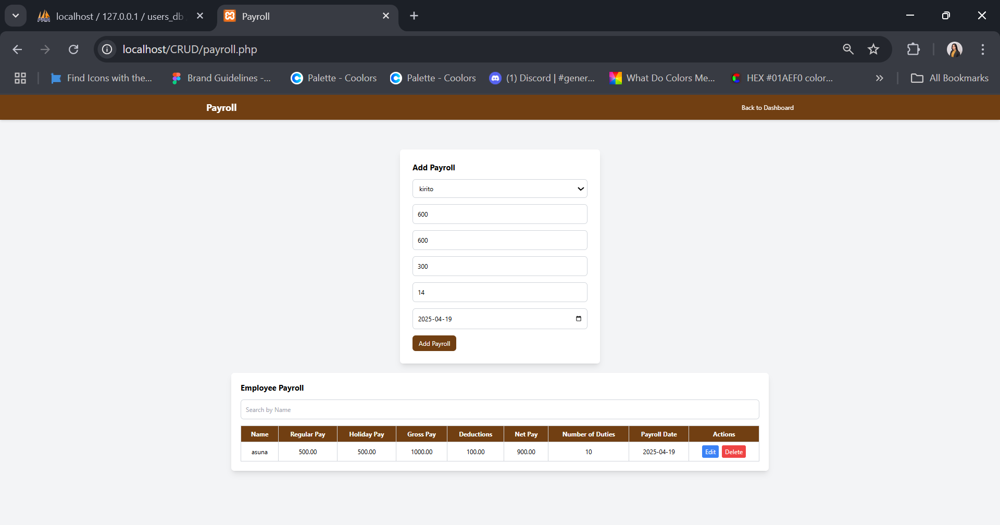
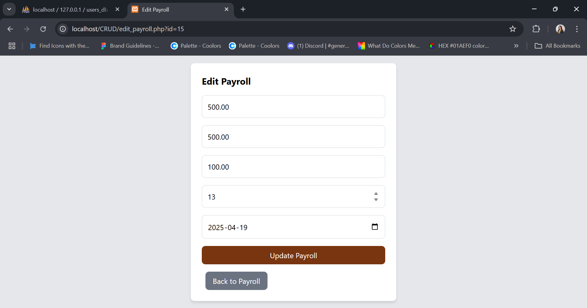

# 🧾 Employee Payroll CRUD System

A simple and clean **Employee Payroll CRUD (Create, Read, Update, Delete)** system built using **PHP** and **MySQL**. It enables admin users to manage employee data, view/edit payrolls, register new accounts, and reset passwords securely.

---

## 🚀 Features

- 🔐 **User Registration**  
  New users can register by providing their name, email, password, and role.

- 🔓 **Login System**  
  Registered users can log in securely using their credentials.

- ❓ **Forgot Password**  
  Users can reset their password via email-based token verification.

- 🧑‍💼 **Admin Dashboard**  
  Provides a centralized view of users and employee data. Allows CRUD operations on payrolls.

- 📋 **Employee List**  
  Admins can view a list of all employees with their names, roles, and actions (edit/delete).

- 💸 **Payroll Management**  
  Admins can add, edit, view, and delete payroll records including salary, hours worked, and overtime.

---

## 🖼️ Screenshots

1. ### **Login Page**  
     
   Users can log in with their registered credentials.

2. ### **Register Page**  
     
   Allows creation of new accounts.

3. ### **Forgot Password Page**  
     
   Users can request a password reset token via email.

4. ### **Admin Dashboard**  
     
   Overview of users and payroll with access to all system functionalities.

5. ### **Employee List**  
     
   Displays all employee records with options to edit or delete.

6. ### **Payroll Page**  
     
   Displays detailed payroll information including regular hours, overtime, and calculated pay.

7. ### **Edit Payroll Page**  
     
   Admins can update existing payroll entries.

## How to Run the Project
1. Clone the Repository:
bash
Copy
Edit
git clone https://github.com/yourusername/employee-payroll-system.git
2. Install Dependencies:
Ensure you have a PHP server like XAMPP or MAMP installed.
bash
Copy
Edit
# Navigate to your project directory
cd employee-payroll-system
3. Set Up the Database:
Create a MySQL database and import the provided database.sql file (or manually set up the database schema).
Update the database connection settings in config.php.

# Example database connection setup:
php
Copy
Edit
$conn = new mysqli('localhost', 'root', '', 'employee_payroll');
4. Run the Application:
Start your PHP server and open the application in your browser at http://localhost/employee-payroll-system.

# Technologies Used
## Backend: PHP

## Frontend: 
HTML, Tailwind CSS, JavaScript, 

## Database: MySQL

